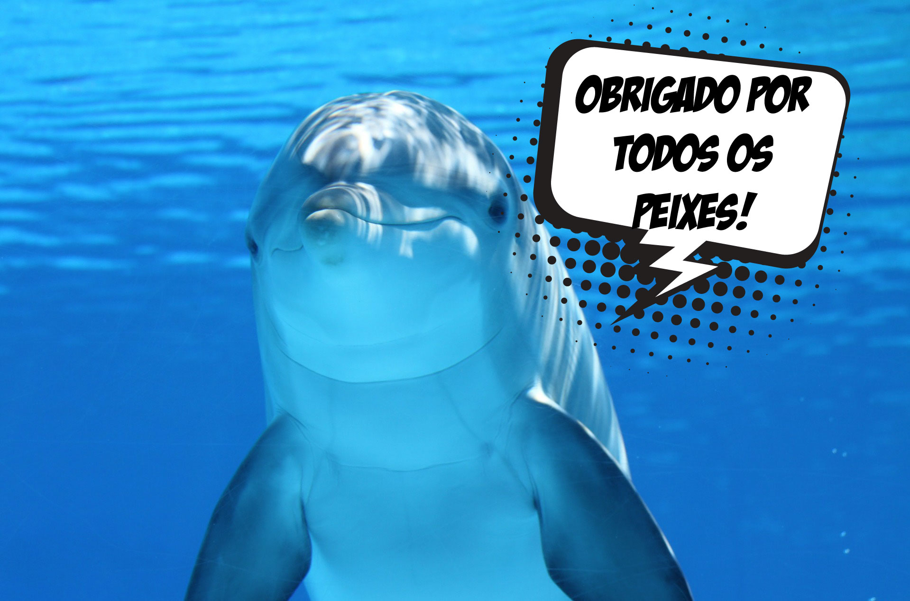
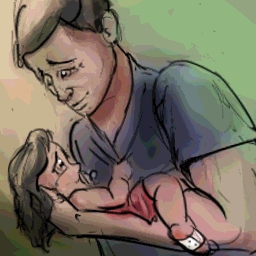

É isso aí. Espero que curta essa onda como estamos curtindo.

# #1 Cops! Rats! Me fudi!

> ID #1. publicado em 25/09/2020. republicado em 19/10/2020.

Aprendi que são inimigos. Quando pisca luz vermelha e azul já vem o reflexo: puta que pariu. Me fudi! Vão descobrir que fiz errado... Mas qq eu fiz mesmo!?

Eaí vem a vida...

... em um rolé com o sonho carburado em trazer o mar pro cerrado (apelido esticado de um nome curto: Buggy) eis que emparelha a caravana do apocalipse, soberana, do meu lado. Maya no carona, seta traseira esquerda pendurada, placa enferrujada, documento atrasado e muita cor pra mostrar que a vida é colorida. O destino era certo.. Beleza. Chegou minha vez. Me fudi.

Meio que olhando do nada com a cara de culpado sem saber do que, fito o inimigo. Máscara covid, óculos escuro, boné feio pra caralho, e uma roupa que mais parece um terno, o rato, ops policial, acena um gesto... era um hang loose, amarradão na onda.

Vivendo e aprendendo. Me fudi. Obrigado 🙏

## [Audio](https://www.youtube.com/watch?v=eljRK15j8NM&ab_channel=BetaCast)

**download audio:** [#1 Cops! Rats! Now I'm fucked!](docusaurus/static/audio/BC-01-cops-audio-remix-pt.mp4)

### [How I Could Just Kill a Man, Rage Against the Machine](https://open.spotify.com/track/4K1DB7EedHPuVnhVrnvf2U)

# #2 Mulherizando-se

> ID #2. publicado em 26/09/2020. republicado em 23/10/2020.

Entre louças, slime escorrendo na ponta da mesa, areia mágica (só pode ter sido um filha da puta desavisado que inventou essa merda) metodicamente espalhado pela casa como se fosse um cuidadoso chefe de cozinha temperando sua arte, reunião com o time, e fome infantil.

PLAC! Quebrou! Deixa eu ir lá ver.

- Papai. A culpa foi sua. Você deixou ela aí.
- Mas foi você que chutou ela. Tudo que acontece aqui tem uma parte minha e uma parte sua.

Estava no meio de uma defesa com os colegas e só falei: pera aí. Volto com pressa, sem deixar dúvida que existe compromisso.

Nessa correria, às vezes a gente acaba sendo displicente. Naturalmente justificável. Coloquei os cacos no saco e no chão.

Choro! Daquele que dói muito mais do que quando é o nosso. Cortou o pé. Desespero. Maior do que quando é o nosso. Mas crescendo a gente aprende que precisa segurar a onda pra resolver a situação.

A semente começa a brotar...

- (choramingosa) Papai, você tirou o saco de lá?
- Tirei sim, minha filha.
- Que bom. Senão você poderia pisar também.

## [Audio](https://youtu.be/TuK3RzucuPs)

**download audio:** [#2 Mulherizando-se](docusaurus/static/audio/BC-02-mulherize-audio-remix-pt.mp4)

## [A Movement in the Light, Fishbone](https://open.spotify.com/track/0iOA8VM16ZgrB1wyoaiig4)

# #3 Fora da onde, ô cara de pau?

> ID #3. publicado em 26/09/2020. republicado em 26/10/2020.

Vamos combinar aqui de falar a verdade. Todo mundo sabe que mulher tá anos luz dos homens. É sério. E isso não é problema nenhum. Isso não é (ou não deveria ser) uma disputa. A gente tinha era que agradecer que elas conseguiram segurar essa porra esse tempo todo de explodir e passar a bola de uma vez.

Mas assim, nasci homem né!? Existe uma parceria muito maneira também entre a gente. E os times podem se formar com todas as combinações... homens, mulheres, negros, homossexuais.. e aí começo a usar a classificação pra simplificar o entendimento e já me dá preguiça. Pessoas, beleza?

Mas hj estou com a camisa do time homem. Vocês são mais espertas em tudo, mas tem uma que vocês deixaram passar. Todo homem está coberto de razão quando não joga o lixo para fora.

Explico: Não dá pra sair. Vai ficar tudo aqui. A Terra não é fora. O riacho aqui do lado não é fora. O carcará comendo guimba de cigarro menos ainda. Então, querida companheira ou companheiro, pega leve da próxima vez que a lata de lixo estiver transbordando de lata de cerveja e nem adianta ficar boladx porque não vai rolar de amarrar o saco.

## [Audio](https://www.youtube.com/watch?v=UnuQeXVfaQw&ab_channel=BetaCast)

**download audio:** [#3 Fora da onde, ô cara de pau?](docusaurus/static/audio/BC-03-fora-onde-audio-remix-pt.mp4)

## [How Strong, Red Hot Chilli Peppers](https://open.spotify.com/track/11YFZ9PQHXeHo0mFxVMLMy?si=GHLNq1a_RtuCPhpTJBfLUg)
