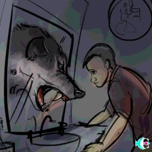

É isso aí. Espero que curta essa onda como estamos curtindo.

# #1 Cops! Rats! Me fudi!

> ID #1. publicado em 25/09/2020. republicado em 19/10/2020.

Aprendi que são inimigos. Quando pisca luz vermelha e azul já vem o reflexo: puta que pariu. Me fudi! Vão descobrir que fiz errado... Mas qq eu fiz mesmo!?

Eaí vem a vida...

... em um rolé com o sonho carburado em trazer o mar pro cerrado (apelido esticado de um nome curto: Buggy) eis que emparelha a caravana do apocalipse, soberana, do meu lado. Maya no carona, seta traseira esquerda pendurada, placa enferrujada, documento atrasado e muita cor pra mostrar que a vida é colorida. O destino era certo.. Beleza. Chegou minha vez. Me fudi.

Meio que olhando do nada com a cara de culpado sem saber do que, fito o inimigo. Máscara covid, óculos escuro, boné feio pra caralho, e uma roupa que mais parece um terno, o rato, ops policial, acena um gesto... era um hang loose, amarradão na onda.

Vivendo e aprendendo. Me fudi. Obrigado 🙏

## [Audio](https://www.youtube.com/watch?v=eljRK15j8NM&ab_channel=BetaCast)

**download audio:** [#1 Cops! Rats! Now I'm fucked!](docusaurus/static/audio/BC-01-cops-audio-remix-pt.mp4)

### [How I Could Just Kill a Man, Rage Against the Machine](https://open.spotify.com/track/4K1DB7EedHPuVnhVrnvf2U)

# #2 Mulherizando-se

> ID #2. publicado em 26/09/2020. republicado em 23/10/2020.

Entre louças, slime escorrendo na ponta da mesa, areia mágica (só pode ter sido um filha da puta desavisado que inventou essa merda) metodicamente espalhado pela casa como se fosse um cuidadoso chefe de cozinha temperando sua arte, reunião com o time, e fome infantil.

PLAC! Quebrou! Deixa eu ir lá ver.

- Papai. A culpa foi sua. Você deixou ela aí.
- Mas foi você que chutou ela. Tudo que acontece aqui tem uma parte minha e uma parte sua.

Estava no meio de uma defesa com os colegas e só falei: pera aí. Volto com pressa, sem deixar dúvida que existe compromisso.

Nessa correria, às vezes a gente acaba sendo displicente. Naturalmente justificável. Coloquei os cacos no saco e no chão.

Choro! Daquele que dói muito mais do que quando é o nosso. Cortou o pé. Desespero. Maior do que quando é o nosso. Mas crescendo a gente aprende que precisa segurar a onda pra resolver a situação.

A semente começa a brotar...

- (choramingosa) Papai, você tirou o saco de lá?
- Tirei sim, minha filha.
- Que bom. Senão você poderia pisar também.

## [Audio](https://youtu.be/TuK3RzucuPs)

**download audio:** [#2 Mulherizando-se](docusaurus/static/audio/BC-02-mulherize-audio-remix-pt.mp4)

## [A Movement in the Light, Fishbone](https://open.spotify.com/track/0iOA8VM16ZgrB1wyoaiig4)

# #3 Fora da onde, ô cara de pau?

> ID #3. publicado em 26/09/2020. republicado em 26/10/2020.

Vamos combinar aqui de falar a verdade. Todo mundo sabe que mulher tá anos luz dos homens. É sério. E isso não é problema nenhum. Isso não é (ou não deveria ser) uma disputa. A gente tinha era que agradecer que elas conseguiram segurar essa porra esse tempo todo de explodir e passar a bola de uma vez.

Mas assim, nasci homem né!? Existe uma parceria muito maneira também entre a gente. E os times podem se formar com todas as combinações... homens, mulheres, negros, homossexuais.. e aí começo a usar a classificação pra simplificar o entendimento e já me dá preguiça. Pessoas, beleza?

Mas hj estou com a camisa do time homem. Vocês são mais espertas em tudo, mas tem uma que vocês deixaram passar. Todo homem está coberto de razão quando não joga o lixo para fora.

Explico: Não dá pra sair. Vai ficar tudo aqui. A Terra não é fora. O riacho aqui do lado não é fora. O carcará comendo guimba de cigarro menos ainda. Então, querida companheira ou companheiro, pega leve da próxima vez que a lata de lixo estiver transbordando de lata de cerveja e nem adianta ficar boladx porque não vai rolar de amarrar o saco.

## [Audio](https://www.youtube.com/watch?v=UnuQeXVfaQw&ab_channel=BetaCast)

**download audio:** [#3 Fora da onde, ô cara de pau?](docusaurus/static/audio/BC-03-fora-onde-audio-remix-pt.mp4)

## [How Strong, Red Hot Chilli Peppers](https://open.spotify.com/track/11YFZ9PQHXeHo0mFxVMLMy?si=GHLNq1a_RtuCPhpTJBfLUg)

# #4 LOUCURA: Muita queimada para pouco bombeiro. Contrata-se.

> ID #4. publicado em 27/09/2020. republicado em 30/10/2020.

Esse negócio de internet é o negócio mais louco mesmo que eu já conheci. Parar pra pensar que eu agora consigo instantaneamente acessar praticamente todo conhecimento registrado pela humanidade é uma coisa muito louca mesmo. Louca louca. Crazeeey! (Tá bom, já deu pra entender)

Mas agora vai ficar mais louco ainda. Além disso que falei, que já é loucura, eu consigo acessar também milhares de situações corriqueiras que acontecem na vida dos outros. Pra esse aqui não dá nem pra encontrar um adjetivo.

Com isso vi um vídeo de uma mulher que tava gerando confusão alheia em ambiente familiar, incomodando a todos e completamente inconsequente. Bombeiro que é bombeiro nunca abandona a missão. Que foi essa outra que jogou água pra apagar o fogo da primeira e ainda teve a grandeza de dizer que tinham vários outros incomodados, mas ela teve que apagar o fogo sozinha..

E aí, eu me lembro do Pastor King.. O QUE ME PREOCUPA NÃO É O GRITO DOS MAUS, MAS O SILÊNCIO DOS BONS

Bombeires. Contrata-se. Paga-se muito bem.

DM @amearquitetura

## [Audio](https://www.youtube.com/watch?v=9r51vzuj_yo&ab_channel=BetaCast)

**download audio:** [#4 LOUCURA: Muita queimada para pouco bombeiro. Contrata-se.](docusaurus/static/audio/BC-04-loucura-audio-remix-pt.mp4)

## [The Lost Art of Keeping a Secret, Queens of the Stone Age](https://open.spotify.com/track/6FlAJtf8aSZOpEj9ITSfYh?si=bBsdD4ByQAuZIm1mAySsJA)

# #5 LOUCURA [O retorno]: Tá tudo queimando. Traz mais lenha, traz mais água.

> ID #5. publicado em 28/09/2020. republicado em 02/11/2020.

Que bom que estou encontrando minhas respostas mais rápido do que esperava. Descobri que com um texto apenas sou capaz de ofender quase todo mundo. Me apego no meu valor, e mentalizo o Pensador: A verdade pode ser manipulada para o mal e para o bem.

Mas e aí, sobre esse episódio mesmo da garrafada? Defender a pessoa do bar quer dizer que sou recalcado e que não aceito a liberdade alheia? Defender a pessoa do carro quer dizer que tenho descaso com o espaço público dos outros?

A real é que não faço a mínima ideia. Se fizesse não tinha gerado confusão, ou pior, teria causado da mesma forma. Mas talvez essa confusão seja importante para uma próxima pergunta: O que aconteceu com a gente que as atitudes e intenções (inclusive a minha) ficaram tão obscuras? O que que aconteceu pra gente comprar a ideia do Hobbes de que o homem é lobo do homem?

Porque disso eu tenho certeza: Se as ações viessem do coração, liberdade não seria uma questão.

## [Audio](https://www.youtube.com/watch?v=9r51vzuj_yo&ab_channel=BetaCast)

**download audio:** [#5 LOUCURA [O retorno]: Tá tudo queimando. Traz mais lenha, traz mais água.](docusaurus/static/audio/BC-05-loucura-retorno-audio-remix-pt.mp4)

## [Preserve, Ultramen](https://open.spotify.com/track/2sU5Ewj2W5pFTuiBFmZxbR?si=asm-cQGOTEKE3C6a0ZsJRQ)

# #6 Muhammad Ali

> ID #6. publicado em 29/09/2020. republicado em 06/11/2020.

Então certa vez fiz um texto sexista sem saber que estava sendo. Fui completamente mal interpretado 2x.

A primeira é grave, a segunda é gravíssima. A primeira são as pessoas que não entenderam o que eu quis dizer. É triste pensar que querendo somar você consegue subtrair. A segunda sou eu mesmo.

É desesperador pensar que pode existir coisa aqui dentro que não consigo ver e que preciso tirar. Ainda bem que a primeira tem muita gentileza comigo, e me ajuda a enxergar coisas em mim que nem eu mesmo consigo ver.

Boxeador que é boxeador tem que saber a hora certa de levantar a guarda, e de abaixar também.

POW! Gratidão.

## [Audio](https://www.youtube.com/watch?v=2Lhe2plhJtY&ab_channel=BetaCast)

**download audio:** [#6 Muhammad Ali](docusaurus/static/audio/BC-0ali-audio-remix-pt.mp4)

## [Se Segura Malandro, Jorge Ben Jor](https://open.spotify.com/track/3LyeB5mKdybZ7zjgjH9fcz?si=0GCkuFiiSz-sYPjySi54fQ)

# #7 O Mundo, a Internet, a Tese e O Convite

> ID #7. publicado em 29/09/2020. republicado em 06/11/2020.

É isso que está acontecendo com o mundo e a internet. As pessoas estão vendo muito mais intimidade alheia do que se é capaz de assimilar. São todos os tipos de situações que existem. Do nascimento, ao sexo à morte. De todo tipo de gente, de famosos a anônimos. Todos esses acontecimentos possuem um contexto. Várias partes envolvidas participaram com alguma bagagem nessa situação.
Mas como o volume de situações é enorme, a gente precisa preencher essa lacuna e o que sobra são nossas suposições.

E aí o distanciamento começa a ocorrer. Amigos de 30 anos estão se separando por isso, políticos repugnantes estão sendo eleitos e tomando as rédeas do mundo. Não é possível que eu seja o único achando isso tudo muito maluco. Pela lei da entropia, a tendência é que esse movimento continue se expandindo no mesmo sentido. Tomara que não, porque por mais que sejamos átomos, somos muito mais também. Se viver não for correr pelo correto não sei o que é. Então bora só reorganizar o coreto e viver mais perto das poucas situações que somos capazes de assimilar com empatia!?

## [Audio](https://youtu.be/18KPTM1-llY)

**download audio:** [#7 O Mundo, a Internet, a Tese e O Convite](docusaurus/static/audio/BC-7-convite-audio-remix-pt.mp4)

## [Se Segura Malandro, Jorge Ben Jor](https://open.spotify.com/track/3LyeB5mKdybZ7zjgjH9fcz?si=0GCkuFiiSz-sYPjySi54fQ)

# #8 Comer e Viajar. Pois é.

> ID #8. publicado em 01/10/2020. republicado em 13/11/2020.

Sextou! É dia da maldade. Dia de parar de fingir que você não é a pessoa que você é. Dia de mentalizar energia positiva pra tudo que está te esperando no fim de semana. Dia de fingir que a vida começou! Dia de começar a viver!

Diz-me-ia um sábio no cume de uma montanha onde a miragem era todo o mundo: “Comer e viajar, as 4 melhores coisas da vida”.

Mesmo sendo auto-explicativo, hoje é sexta-feira e tô a fim de zoar:

Sabe o sabor daquele camarão caprichadamente enrolado no fubá e temperado com especiarias? Pois é! Delícia, né?

Sabe aquele pastel de carne que sai da fritadeira pingando de óleo que precisa de muita atenção pra não se queimar? Pois é! Delícia, né?

Sabe aquela trip que você chega ao aeroporto, passa por toda cerimônia, senta na janela e acha que está no céu? Pois é! Delícia, né?

Sabe aquele rolé de bike que você tá fora do carro, dá pra ouvir os passarinhos, ver as moças bonitas, ver tudo com muito mais cor e dimensão? Pois é! Delícia, né?

Sabe aquele ônibus pra Chapada agendado pra sair às 4:20 sem horário pra voltar? Pois é! Delícia, né?

Sabe aquele linguado despelado, temperado, que derrete na boca...? Pois é! Delícia, né?

Sabe aquela flor que foi criada pra apertar, comer, destilar, desfiar, ...? Pois é! Delícia, né?

Agora é a tua vez de ESCOLHÊ qual vai SÊ do FINDÊ... Pois é! Delícia, né?

## [Audio](https://youtu.be/Cvyu3FMC7_Y)

**download audio:** [#8 Comer e Viajar. Pois é.](docusaurus/static/audio/BC-8-comer-viajar-audio-remix-pt.mp4)

## [Caliente, Los Pericos](https://open.spotify.com/track/7k9655GBLcnaQq1w2ak29r?si=FzI8pj0gTr-qzh1vllLbng)

# #9 Excesso de Paciência

> ID #9. publicado em 30/11/2020.

Fico pensando assim: o povo brasileiro é tão foda, mas tão foda, que até na paciência a gente é exagerado. Paciência é uma qualidade muito importante pra se navegar nesse mundão e na vida. Importante manter na cabeça pra não fritar que nem peixe agulhinha nas praias de Maceió.

E que paciência é essa que eu tô falando? É pra tudo... desde receber um gringo aqui e aceitar que ele faça tudo que tiver afim nessa terrinha, quanto aturar abutres comendo o Brasil por dentro lá na cúpula corrupta que não se derrete desde sempre. Essa terra, Brasil, é nossa. De quem já estava aqui antes da chegada deles, de quem foi trazido por eles, e de quem se misturou com eles. O Brasil é isso tudo, uma mistura que parece ter sido feita de qualquer jeito, e que talvez esse qualquer jeito seja o nosso jeito, o melhor jeito. E se somos isso tudo mesmo, pra que ficar aturando quem não dá valor, nem pra cultura, nem para o povo, nem para a natureza? Até quando a gente vai ficar levando porrada!?

## [Audio](https://youtu.be/jVURoFh6u3k)

**download audio:** [#9 Excesso de Paciência](docusaurus/static/audio/BC-09-excesso-paciencia-audio-remix-pt.mp3)

## [Patience, Nas & Damian “Jr. Gong” Marley](https://open.spotify.com/track/2y8pG9CF0HC4cttJ50Pufk)

# #10 Albert da Percepção

> ID #10. publicado em 04/12/2020.

Sabe, penso sobre isso também. Perceber os 5 sentidos é trivial. Foi o que recebemos para navegar aqui na materialidade. É o que parece pra gente de mais "concreto". Mas tem uns aí que dizem que temos outros sentidos, só que são muito mais sutis de perceber. Tipo papo de chacras. Essa eu peguei da internet, mas oq mais dizer?: "Segundo Jordan Duchnycz, os chakras são o motor elétrico da alma".

Aí, certa vez, subindo <O> Monte, abro uma porta. Era Huxley falando sobre a necessidade do cérebro de criar um filtro para o pleno, de modo que nossa espécie pudesse focar na prosperidade. Primeiro vem sobreviver e reproduzir. Mas tem muito mais, que ele metodicamente estudou e registrou em seu ensaio com LSD no Portas da Percepção. Fica a dica ;)

A outra coisa que me faz refletir sobre isso é que: algo que nos traz para a materialidade é a ciência. Só que quem conseguiu modelar a natureza em matemática, tipo Einstein, disse isso: "Quanto mais me aprofundo na Ciência mais me aproximo de Deus".

Então... sei lá, né!? Vai saber... De uma certa forma nossas crenças acabam influenciando oq acontece nas nossas vidas... será!?

## [Audio](https://youtu.be/jVURoFh6u3k)

**download audio:** [#10 Albert da Percepção](docusaurus/static/audio/BC-10-albert-percepcao-audio-remix-pt.mp3)

## [Uma Ajuda, O Rappa](https://open.spotify.com/track/7DNUgm6huY0X8yTaDe44M7)

# #11 Água

> ID #11. publicado em 07/12/2020.

Água é vida
Água é boa
Água é tudo
É a coisa mais gostosa desse mundo
(Água é Tudo, Dois Sóis
https://open.spotify.com/track/6b0hHAWJlQpbeppWXhRdMA?si=TSdYpcnJS6aNbp8fP3YyXQ)

Água é toda
Água é luz
Água é noix
É a coisa mais gostosa nos Lençóis

É da onde vem
Pra onde vai
De onde fui
É a coisa mais perfeita que aflui

Está em tudo
Está em noix
Estamos nela
É a coisa mais bonita da janela

Água é... Deus?
## [Audio](https://youtu.be/gg7kPDOJ1_4)

**download audio:** [#11 Água](docusaurus/static/audio/BC-11-agua-audio-remix-pt.mp3)

## [Água é Tudo, Dois Sóis, Carú Ricardo](https://open.spotify.com/track/6b0hHAWJlQpbeppWXhRdMA)

# #12 GitHub. Rede social. Resistência. Revolução. Palavras, imagens, códigos.

> ID #12. publicado em 11/12/2020.

A Rede social do futuro se chama GitHub. Não é do futuro a que vai ser o maior hype cool que todos estão usando. Do futuro, eu quero dizer: quem vai CONSTRUIR o futuro. Não é brincadeira. Essa parada foi inventada por: os caras do Git e Linus Torvalds (Ele de novo. O cara que fez o Linux, aquele sistema operacional que você nem imagina que é muito mais simples de usar que o famoso Windows.)

Mas não deixa de ser uma rede social. Busco ser bem didático, mas conheço pouco as outras redes sociais: você cria um perfil seu do mesmo jeito, foto, about, o que você gosta da vida. Mas você não publica fotos, nem textos, nem textos até 200 letras, nem que sua vida é boa mesmo que não seja. Lá você publica o seu trabalho. Mas não é qualquer trabalho. É código. Então lendo o código desse "match" você descobre a maturidade de programação que a pessoa/projeto tem, no que ela se envolve, se são mais projetos voluntários, se são projetos de alguma empresa capitalista, qual linguagem de programação que essa pessoa tem mais experiência, etc.. do tipo, acabei de escrever isso e imaginei que um código diz mais do que 1000 imagens.

Sobre resistência e revolução. Essa parada é rede social. Botou lá nunca mais é seu. Todo mundo usa. Tu não vai ganhar 1 centavo por isso. Tipo aquele vídeo de revenge porn que todo mundo se fode. Mas nesse caso ninguém se fode. O like do camaradinha chama "pull request" e é um reply pro teu código melhorando ele.

Se isso não é resistência e revolução, eu não sei o que é. Que camaradagem essa galera da TI tem. Isso porque esses felasdaputa tem um coração muito grande e não querem que os outros se fodam tanto quanto eles se fuderam. Aí eles escrevem um super manual de graça te dizendo como escapar de uma tarde miserável.

Habemus esperança.

## [Audio](https://youtu.be/LR5TlLVNlWg)

**download audio:** [#12 GitHub. Rede social. Resistência. Revolução. Palavras, imagens, códigos.](docusaurus/static/audio/BC-12-github-audio-remix-pt.mp3)
## [Collective Mode, Asian Dub Foundation](https://open.spotify.com/track/5uycfDlFeV8QcbPlO4Gg4C)
# #13 Meu Patrão

> ID #13. publicado em 14/12/2020.

Pois é. Sou funcionário público, acredita? Programo robôs que ficam buscando dados em tudo que é canto e junta pra ajudar aos tomadores de decisão fazer algo mais racional.

Independente do governo sempre fiz meu trabalho da mesma forma, pelo seguinte motivo: Não existe A, B, Vermelho, Azul, Esquerda, Direita sem interesses escusos (pra ser educado). Então, quanto melhor eu faço meu trabalho, no mínimo constrangido eu deixo essa galera na hora de justificar uma decisão injustificável.

Ou seja, meu patrão, foi, é, e sempre será você, cidadão brasileiro.
## [Audio](https://youtu.be/K1VuinR-BRE)

**download audio:** [#13 Meu Patrão](docusaurus/static/audio/BC-13-patrao--audio-remix-pt.mp3)
## [O Pão de Cada Dia, Gabriel o Pensador](https://open.spotify.com/track/3IAP6p0J8BmuhgvETGkr4T)

# #14 IGP-M. Um absurdo.

> ID #14. publicado em 18/12/2020.

Todo ciclo chegam aqueles intermediários que não servem pra nada além de cobrar - corretora de imóvel - pra dar aquele UP no esquema.
Mas outro dia escutei uma história diferente. Ou melhor, invertida. A pessoa que pagava queria aumentar o aluguel enquanto que a que recebia não aceitou.

E aí eu fico aqui pensando.. a que ponto chegou essa relação!? Que absurdo! Em vez de cada um pensar em si próprio tá pensando no outro.
Desejo que todos tenhamos oportunidades de passar por esse tipo de constrangimento nas nossas vidas também.

## [Audio](https://youtu.be/uisXGuyqAEw)

**download audio:** [#14 IGP-M. Um absurdo.](docusaurus/static/audio/BC-14-igpm-audio-remix-pt.mp3)

## [Love Someone, Dub FX](https://open.spotify.com/track/2nwFHAPVMpdiFGrl4GpOhA)

# #15 Artista Profissional

> ID #15. publicado em 21/12/2020.

Ae, galera!! Se você é um desses, entra em contato por favor. Estou, sem sacanagem, há pelo menos 10 anos correndo atrás disso e só bato a cabeça na parede.

Do tipo: minha arte morre se tiver prazo e floresce 10x o tempo se não tiver prazo. É tipo papo de ignorância mesmo da minha parte.

Mas o mais importante mesmo dessa história é: there's no control.

Fica a dica. Pra mim, e pra você. 😘
## [Audio](https://youtu.be/Iwbeo4BjwNo)

**download audio:** [#15 Artista Profissional](docusaurus/static/audio/BC-15-artista-profissional-audio-remix-pt.mp3)

## [Cheio de Vazio, Paulinho Moska](https://open.spotify.com/track/2nwFHAPVMpdiFGrl4GpOhA)

# #16 The Beatles. Você decide.

> ID #16. publicado em 25/12/2020.

Eu queria saber mais sobre eles. Mas a vida é longa. Confesso que estudei pouco, escutei pouco e só nasci depois que eles tinham ido. Mas dá de alguma forma pra sentir a emoção, a transformação que eles trouxeram ao mundo.

Lembra do “Você Decide”? Pra quem é mais novo, uma velharia: “Você Decide” era tipo um episódio de um seriado (mas cada um uma história) que passava semanalmente na Globo apresentado pelo Tony Ramos. A história (drama) se desenrolava e no final você tinha 2 números de telefone para discar para votar qual dos dois finais possíveis você queria ver. A maioria vencia e esse final era apresentado no último quadro.

Bom, agora o “Você Decide” deste texto:

Final 1:

Muito pelo pouco que vi, mais ainda porque eles representaram muito para o meu pai e **coisas boas passam entre gerações.**

Final 2:

Muito pelo pouco que vi, mais ainda porque eles representaram muito para o meu pai e **tudo que é bom tem um fim.**

## [Audio](https://youtu.be/F8_mk0mlcfg)

**download audio:** [#16 The Beatles. Você decide.](docusaurus/static/audio/BC-16=beatles-audio-remix-pt.mp3)

## [Blackbird, The Beatles](https://open.spotify.com/track/5jgFfDIR6FR0gvlA56Nakr)