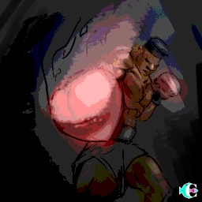
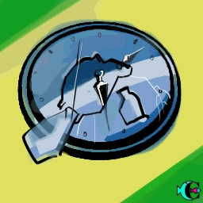
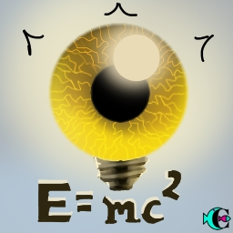
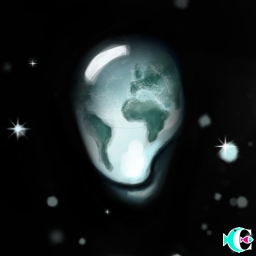
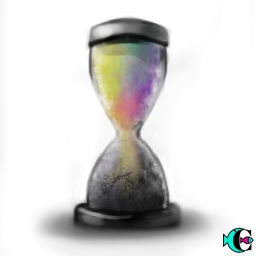

That's it. Hope that you drop this wave with the same joy that we do.

# #1 Cops! Rats! Now I'm fucked!

> ID #1. published 09/25/2020. republished 10/19/2020.

I learned they're the enemy. When the red and blue flashes, I immediately go “holy shit”. I’m fucked!! They'll see I messed up... But what was it that I messed up again!?

Then life comes back...

...in a carburated ride of a dream of bringing the sea to the highlands (an unnecessarily long alias for a short name: Dune Buggy). Lo and behold, the apocalypse motor vehicle, almighty, pulls over next to me. Maya is riding shotgun, the left turn light is hanging out, license plate rusty as fuck, the car registration is way expired and there's just loads of colors, just to show how colorful life is. My fate therefore was dead obvious... Great. Now it's my turn. I am fucked.

From out of nowhere I gaze, looking guilty of nothing and everything, I stare at the enemy. Covid mask, sunglasses, hideous as fuck hat and wearing an ensemble that looks like a suit, the rat... I mean, the cop, waves... He was giving me a shaka, absolutely psyched with the ride.

You live and learn. Now I’m fucked. Thanks. 🙏

## [Audio](https://www.youtube.com/watch?v=q8GWsk6FiT8&ab_channel=BetaCast)

**download audio:** [#1 Cops! Rats! Now I'm fucked!](docusaurus/static/audio/BC-01-cops-audio-remix-en.mp4)

### [How I Could Just Kill a Man, Rage Against the Machine](https://open.spotify.com/track/4K1DB7EedHPuVnhVrnvf2U)

# #2 Womanize yourself

> ID #2. published 09/26/2020. republished 10/23/2020.

Dirty dishes, slime dangling on the table, magic sand (it takes one real unwise motherfucker to come up with shit like that) methodically spread out throughout the house as if it were the richest of spices dressing the art of a careful chef, meeting with the team and child hunger.

PLAC! Something broke! Let's go see what happened.

- Daddy. It was your fault. You left it there.
- But you were the one who kicked it. Everything that takes place in this house is equal parts me and you.

I was halfway making a huge point with my colleagues and only had time to say: hold on. I rush back, showing how committed I am to that shit.

Life sometimes has a way to make us negligent to certain things. It's naturally justifiable. I sweep the broken pieces into a bag and rest it on the floor.

Crying is heard! The type of crying that hurts a lot more than our own. Maya cut her foot. I despair. A lot more than if it had been me. But as we grow we learn that we need to keep it all down so as to deal with the crisis.

My seed is now sprouting...

- (crying) Daddy, did you take the bag out of there?
- I did, sweetie.
- Good. You could have stepped on it too.

## [Audio](https://youtu.be/9NI3pUabZlQ)

**download audio:** [#2 Womanize yourself](docusaurus/static/audio/BC-02-mulherize-audio-remix-en.mp4)

## [A Movement in the Light, Fishbone](https://open.spotify.com/track/0iOA8VM16ZgrB1wyoaiig4)

# #3 Out of where, you cheeky fuck?

> ID #3. published 09/26/2020. republished 10/26/2020.

Let's agree to speak nothing but the truth here. Everyone knows that women are light years ahead of men. I mean it. And that's not a problem. This is not (or rather should not be) a contest. We should thank them for stopping this shit from bursting all this time and just give them the ball to do with as they please.

But, I mean, I was born man, right!? There's also the coolest partnership between us. And teams can follow all combinations... Men, women, homosexuals. Then I start using the established classification so as to simplify understanding it and am overcome with such laziness. People, right?

But today I wear the men's jersey. You are smarter in everything, but there's one thing you're missing out on. Every man is absolutely right when they don’t take the trash out.

Let me explain: You can't get out. It's all staying here. The Earth is not out. The creek right over there is not out. The raven pecking at a cigarette stub is surely not out. So, my dear companion, take it easy next time the trash can is overflowing with beer cans and you can't even get mad because tying the bag close is a no go.

## [Audio](https://www.youtube.com/watch?v=2zjeiiEhjeI&ab_channel=BetaCast)

**download audio:** [#3 Out of where, you cheeky fuck?](docusaurus/static/audio/BC-03-fora-onde-audio-remix-en.mp4)

## [How Strong, Red Hot Chilli Peppers](https://open.spotify.com/track/11YFZ9PQHXeHo0mFxVMLMy?si=GHLNq1a_RtuCPhpTJBfLUg)

# #4 MADNESS: Too much fires for too few firefighters. We're hiring!

> ID #4. published 09/27/2020. republished 10/30/2020.

This internet business really is the craziest shit I've ever seen. It's crazy when I think that I can instantaneously access pretty much all of recorded human knowledge whenever I want. It's cray cray. Crazeeey! (Okay, you get the point)

But now shit's about the get even crazier. What I just said is crazy enough, but I can also access thousands of ordinary situations taking place in the lives of others. I can't even thing adjectives for that one.

Because of that I saw a video of a woman doing hardcore porn in a family environment, hence disturbing everyone and not giving a shit. A true firefighter never quits. That's the one who put out the fire in that bimbo's ass and was magnanimous enough to say that a lot of people were bothered by that, but she had to kill that fire by herself.

That's when I remember Pastor King. THE ULTIMATE TRAGEDY IS NOT THE OPPRESSION AND CRUELTY BY THE BAD PEOPLE BUT THE SILENCE OVER THAT BY THE GOOD PEOPLE.

Firefighters. We're hiring! We pay very well.

DM @amearquitetura

## [Audio](https://www.youtube.com/watch?v=ZlwP3vvfFL4&ab_channel=BetaCast)

**download audio:** [#4 MADNESS: Too much fires for too few firefighters. We're hiring!](docusaurus/static/audio/BC-04-loucura-audio-remix-en.mp4)

## [The Lost Art of Keeping a Secret, Queens of the Stone Age](https://open.spotify.com/track/6FlAJtf8aSZOpEj9ITSfYh?si=bBsdD4ByQAuZIm1mAySsJA)

# #6 Muhammad Ali

> ID #6. published 09/29/2020. republished 11/06/2020.

So once I wrote a sexist something without knowing it was sexist. I was misinterpreted twice.

Being misinterpreted for the first time is a serious matter, when it happens a second time it's dangerously serious. First time was by people who didn’t understand what I meant. It's so sad realizing you end up subtracting when all you wanna do is add. Second time I misinterpreted myself.

It's exasperating to think that there might be something in here that I can't see and that I need to root out. It's a good thing that people are all so kind to me and help me see things in myself that I myself can't see.

A true boxer must know when to have his guard raised and when to lower it.

POW! Thanks.

## [Audio](https://www.youtube.com/watch?v=YucxkRQ9tws&ab_channel=BetaCast)

**download audio:** [#6 Muhammad Ali](docusaurus/static/audio/BC-0ali-audio-remix-en.mp4)

## [Se Segura Malandro, Jorge Ben Jor](https://open.spotify.com/track/3LyeB5mKdybZ7zjgjH9fcz?si=0GCkuFiiSz-sYPjySi54fQ)

# #7 The World, the Internet, the Thesis and The Invitation

> ID #7. published 09/30/2020. republished 11/09/2020.

Here's what's happening to the world and the internet. People are now able to see much more of other people's intimate lives than they're able to assimilate. There are all kinds of situations. From birth to sex to death. By all kinds of people, famous and anonymous. All these events have a context. Several of the parties involved participated with some baggage.
But because the volume of situations is huge, we need to fill that gap, and what remains are our assumptions.

And then you start to grow apart. Friends of 30 years are growing apart, repugnant politicians are being elected and taking the reins of the world. I can't be the only one who thinks this is all very crazy. According to the law of entropy, there's a trend for this movement to keep expanding in the same direction. I hope not, because as much as we are atoms, we are so much more as well. If living is not doing right, I don't know what it is. So shall we get our shit together and live in closer proximity to the situations we are able to assimilate with empathy!?

## [Bom Senso, E Aí King?](https://open.spotify.com/track/5Je169jvuK3BBZKy09m5Yn?si=zxOK06DnTkyzrMgehLlpuA)

# #8 Eating and Traveling. Oh yeah.

> ID #8. published 10/01/2020. republished 11/13/2020.

TGIF! Tis the day of wickedness. Tis the day to stop pretending you're not who you are. Tis the day of vibrating positive energies to everything that the weekend has in store for you. Tis the day to pretend life just started! Tis the day to start living!

Once said a wise man on the top of the mountain where the illusion was the entire world itself: Eating and traveling, the 4 best things in life.

Even though it's self-explanatory, today is Friday and I feel like having a laugh.

You know how good that shrimp carefully breaded and seasoned tastes? Oh yeah! Delicious, huh?

You know those fries coming out of the fryer dripping oil that you have to be very careful lest you get burned? Oh yeah! Delicious, huh?

You know that trip when you get to the airport, go through all the hoops, get a window seat and feel like you're in heaven? Oh yeah! Delicious, huh?

You know that bike ride when you, not enclosed inside a car, can hear the birds, see the beautiful ladies and see everything with much more color and dimension? Oh yeah! Delicious, huh?

You know that one-way bus to the Chapada scheduled to leave at 4:20? Oh yeah! Delicious, huh?

You know that beautifully dressed flounder that melts in your mouth...? Oh yeah! Delicious, huh?

You know that flower bred to be eaten, smelled and done all kinds of thing with...? Oh yeah! Delicious, huh?

Now it's your turn to choose what you're doing on your weekend... Oh yeah! Delicious, huh?

## [Audio](https://youtu.be/hGUCXjnOc5M)

**download audio:** [#8 Eating and Traveling. Oh yeah.](docusaurus/static/audio/BC-8-comer-viajar-audio-remix-en.mp3)

## [Caliente, Los Pericos](https://open.spotify.com/track/7k9655GBLcnaQq1w2ak29r?si=FzI8pj0gTr-qzh1vllLbng)

# #9 Excessive Patience

> ID #9. published 11/30/2020.

Here's my two cents: the Brazilian people is so fucking amazing, so fucking intense, that even our patience is excessive. Patience is a very important trait to have to navigate this world and this life. It's pretty important to have it so your brain doesn't fry like fish in batter.

But what exactly is this patience I'm talking about? Well, it's for everything... From hosting a gringo in Brazil with the realization that you're just gonna let him do whatever the fuck he likes over here, to putting up with all the vultures eating Brazil from inside out yonder at the corrupt council that simply won't melt away. This land, Brazil, is ours. It belongs to those who were here before they arrived, to those who were brought and to those they bred with. Brazil is all of this, a cocktail of stuff put together aimlessly, and maybe this aimlessness is just our way, the best way. And, if we are all this, why in all fuck should we suffer those who don't appreciate us, who don't appreciate our culture, our people or our nature? How long are we going to let this abuse go on!?
## [Audio](https://youtu.be/MrOMxUSBy5o)

**download audio:** [#9 Excessive Patience](docusaurus/static/audio/BC-09-excesso-paciencia-audio-remix-en.mp3)

## [Patience, Nas & Damian “Jr. Gong” Marley](https://open.spotify.com/track/2y8pG9CF0HC4cttJ50Pufk)
# #10 Albert of Perception

> ID #10. published 12/04/2020.

You know, I think about that too. Having a perception of the 5 senses is trivial. They’re what we were given so we could navigate the material world. They're our “concrete” tools to have a dialogue with the world. But some people say we have other senses, but these require much more subtlety to perceive. Like that chakra shit. I got this from the internet, what else is there to be said?: "According to Jordan Duchnycz, chakras are the electric motor of the soul."

This one time, going up the <O>, I open a door. It was Huxley talking about the brain's need to create a filter for the full blast of human experience, so that our species could focus on prosperity. First we survive and then we reproduce. But there's so much more he methodically studied and recorded in his experiences with LSD in his book “The Doors of Perception”. I highly recommend it	;)

The other thing that makes me reflect on this is that science is something that brings us down to the physical realm. But those who managed to model nature into mathematics, like Einstein, said: "The more I get deeper in Science, the closer I get to God".

So... What do I know!? Who knows... In a certain way, I wonder if our beliefs influence what happens in our lives...
## [Audio](https://youtu.be/MrOMxUSBy5o)

**download audio:** [#10 Albert of Perception](docusaurus/static/audio/BC-10-albert-percepcao-audio-remix-en.mp3)

## [Uma Ajuda, O Rappa](https://open.spotify.com/track/7DNUgm6huY0X8yTaDe44M7)

# #11 Water

> ID #11. published 12/07/2020.

Water is life
Water is good
Water is everything
It's the most delicious thing in this planet
(Água é Tudo, Dois Sóis
https://open.spotify.com/track/6b0hHAWJlQpbeppWXhRdMA?si=TSdYpcnJS6aNbp8fP3YyXQ)

Water is everything
Water is light
Water is us
It's best thing ever in our sight

It's where it comes from
It's where it goes
It's where I once was
The most perfect thing that flows

It's in everything
It's in us
We're in it
The most beautiful thing He bestows

Water is... God?

## [Audio](https://youtu.be/sBRvb-RLsMM)

**download audio:** [#11 Water](docusaurus/static/audio/BC-11-agua-audio-remix-en.mp3)

## [Água é Tudo, Dois Sóis, Carú Ricardo](https://open.spotify.com/track/6b0hHAWJlQpbeppWXhRdMA)

# #12 Github. Social network. Resistance. Revolution. Words, images, codes.

> ID #12. published 12/11/2020.

The social network of the future is called GitHub. And by future I don't mean it's going to get the living shit hyped out of it. By future I mean the one who's going to BUILD the future. I kid you not. This shit was invented by github guys and Linus Torvalds - there he goes again, the dude guy who made Linux, that operating system that you can't even fathom to be much simpler to use than Windows.

But it is still a social network. I don't know much about the other social networks, but in GitHub you create your profile in the same way: photo, about, your likes... But you don't post photos, texts, not even 200 character posts, nor do you show off your amazing even though it ain't. There you publish your work. But it's not just any work. It’s code. So, by reading the code of this "match", you find out the coding savvy that person/project has, what it's involved in, if these are more voluntary projects or from some major capitalist corporation, what programming language that person is more experienced in, etc. For example, I just finished writing this and realized that a code speaks louder than 1000 pictures.

About resistance and revolution. This shit is a social network. If you post it there, it's never gonna be yours again. Everyone uses it. You won't make a dime out of it. Like that revenge porn that fucks everybody. But, in this case, no one gets fucked. Like is called a "pull request" and it's a reply to your code improving it.

If that is not resistance and revolution, I don’t know what is. Such camaraderie this IT crowd has. That's because these motherfuckers have huge hearts and don’t want people to go through as much trouble as they did. So they write an amazing manual for free telling you how to run from a miserable afternoon.

Habemus hope.

## [Audio](https://youtu.be/TxK3Xdd-FhY)

**download audio:** [#12 Github. Social network. Resistance. Revolution. Words, images, codes.](docusaurus/static/audio/BC-12-github-audio-remix-en.mp3)
## [Collective Mode, Asian Dub Foundation](https://open.spotify.com/track/5uycfDlFeV8QcbPlO4Gg4C)

# #13 My Boss

> ID #13. published 12/14/2020.

I work for the government. There you go. Can you believe it? I code bots that search for data everywhere and compile said data so as to help the decision makers do something more rational.

Regardless of who's in office, I have always done my work in the same way, for the following reason: there is no A, B, Red, Blue, Left, Right without ulterior motives (this is me being polite). So, the better I do my job, the more embarrassed I make these cunts when justifying an unjustifiable decision they make.

In other words, my boss is, has always been and will always be you, the Brazilian citizen.
## [Audio](https://youtu.be/R8rkL56lSpc)

**download audio:** [#13 My Boss](docusaurus/static/audio/BC-13-patrao-audio-remix-en.mp3)
## [O Pão de Cada Dia, Gabriel o Pensador](https://open.spotify.com/track/3IAP6p0J8BmuhgvETGkr4T)
# #14 Rent's gone up. Fuck that.

> ID #14. published 12/18/2020.

In every cycle, there comes a time when a bunch of useless fucking middlemen who are shit in everything but in getting their paycheck - like those fucking real estate agent cunts - just so they can wet their whistle a little, the fucks.
The other day, however, I heard a different story. Better yet, it was the same story, but the other way around. A lessee wanted her rent to go up, whereas the lessor would have none of that shit.

That got me wondering... How does that even happen? That's absurd! Instead of thinking only of themselves, they were thinking of each other.
It's my undying with that all of us are lucky enough to go through an awkward moment like this at least once in our lives as well.

## [Audio](https://youtu.be/xr67nJo92Qk)

**download audio:** [#14 Rent's gone up. Fuck that.](docusaurus/static/audio/BC-14-igpm-audio-remix-en.mp3)

## [Love Someone, Dub FX](https://open.spotify.com/track/2nwFHAPVMpdiFGrl4GpOhA)

# #15 Art as a Living

> ID #15. published 12/21/2020.

Hey, guys, if you make art as living, please holler at me. I have been, I shit you not, trying to do that for over 10 years, which is curiously the same amount time I've been hitting my to a wal.

Like, my art dies if I gotta meet a deadline and it blooms 10+ times better if no deadline is involved. So I'm actually very ignorant on this.

But the main thing on all of this is: there's no control.

That's my free tip of the day to you (and I could actually use that too).

## [Audio](https://youtu.be/Iwbeo4BjwNo)

**download audio:** [#15 Art as a Living](docusaurus/static/audio/BC-15-artista-profissional-audio-remix-en.mp3)

## [Cheio de Vazio, Paulinho Moska](https://open.spotify.com/track/2nwFHAPVMpdiFGrl4GpOhA)