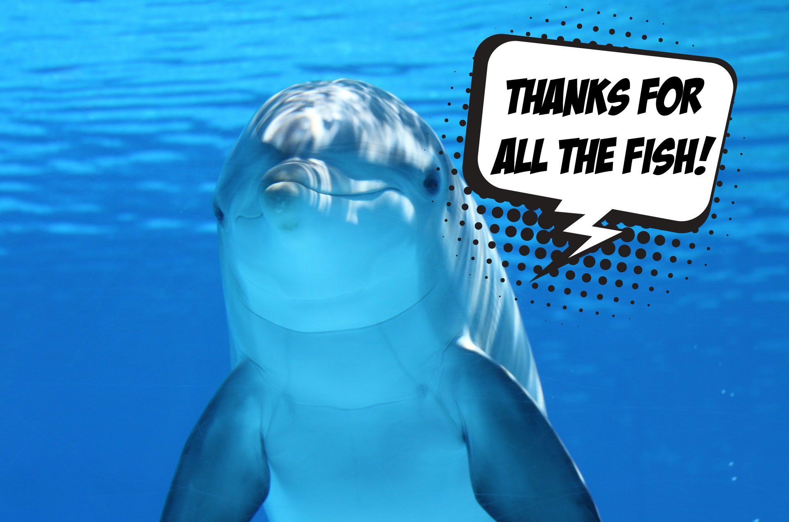

That's it. Hope that you drop this wave with the same joy that we do.

# #1 Cops! Rats! Now I'm fucked!

> ID #1. published 09/25/2020. republished 10/19/2020.

I learned they're the enemy. When the red and blue flashes, I immediately go “holy shit”. I’m fucked!! They'll see I messed up... But what was it that I messed up again!?

Then life comes back...

...in a carburated ride of a dream of bringing the sea to the highlands (an unnecessarily long alias for a short name: Dune Buggy). Lo and behold, the apocalypse motor vehicle, almighty, pulls over next to me. Maya is riding shotgun, the left turn light is hanging out, license plate rusty as fuck, the car registration is way expired and there's just loads of colors, just to show how colorful life is. My fate therefore was dead obvious... Great. Now it's my turn. I am fucked.

From out of nowhere I gaze, looking guilty of nothing and everything, I stare at the enemy. Covid mask, sunglasses, hideous as fuck hat and wearing an ensemble that looks like a suit, the rat... I mean, the cop, waves... He was giving me a shaka, absolutely psyched with the ride.

You live and learn. Now I’m fucked. Thanks. 🙏

## [Audio](https://www.youtube.com/watch?v=q8GWsk6FiT8&ab_channel=BetaCast)

**download audio:** [#1 Cops! Rats! Now I'm fucked!](docusaurus/static/audio/BC-01-cops-audio-remix-en.mp4)

### [How I Could Just Kill a Man, Rage Against the Machine](https://open.spotify.com/track/4K1DB7EedHPuVnhVrnvf2U)

# #2 Womanize yourself

> ID #2. published 09/26/2020. republished 10/23/2020.

Dirty dishes, slime dangling on the table, magic sand (it takes one real unwise motherfucker to come up with shit like that) methodically spread out throughout the house as if it were the richest of spices dressing the art of a careful chef, meeting with the team and child hunger.

PLAC! Something broke! Let's go see what happened.

- Daddy. It was your fault. You left it there.
- But you were the one who kicked it. Everything that takes place in this house is equal parts me and you.

I was halfway making a huge point with my colleagues and only had time to say: hold on. I rush back, showing how committed I am to that shit.

Life sometimes has a way to make us negligent to certain things. It's naturally justifiable. I sweep the broken pieces into a bag and rest it on the floor.

Crying is heard! The type of crying that hurts a lot more than our own. Maya cut her foot. I despair. A lot more than if it had been me. But as we grow we learn that we need to keep it all down so as to deal with the crisis.

My seed is now sprouting...

- (crying) Daddy, did you take the bag out of there?
- I did, sweetie.
- Good. You could have stepped on it too.

## [Audio](https://youtu.be/9NI3pUabZlQ)

**download audio:** [#2 Womanize yourself](docusaurus/static/audio/BC-02-mulherize-audio-remix-en.mp4)

## [A Movement in the Light, Fishbone](https://open.spotify.com/track/0iOA8VM16ZgrB1wyoaiig4)