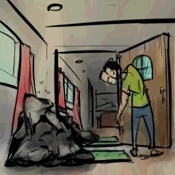

> ID #3. published 09/26/2020. republished 10/26/2020.

 <iframe width="370" height="208" src="https://www.youtube.com/embed/2zjeiiEhjeI" frameborder="0" allow="accelerometer; autoplay; clipboard-write; encrypted-media; gyroscope; picture-in-picture" allowfullscreen></iframe>

Let's agree to speak nothing but the truth here. Everyone knows that women are light years ahead of men. I mean it. And that's not a problem. This is not (or rather should not be) a contest. We should thank them for stopping this shit from bursting all this time and just give them the ball to do with as they please.

But, I mean, I was born man, right!? There's also the coolest partnership between us. And teams can follow all combinations... Men, women, homosexuals. Then I start using the established classification so as to simplify understanding it and am overcome with such laziness. People, right?

But today I wear the men's jersey. You are smarter in everything, but there's one thing you're missing out on. Every man is absolutely right when they don’t take the trash out.

Let me explain: You can't get out. It's all staying here. The Earth is not out. The creek right over there is not out. The raven pecking at a cigarette stub is surely not out. So, my dear companion, take it easy next time the trash can is overflowing with beer cans and you can't even get mad because tying the bag close is a no go.

**download audio:** <a href="/audio/BC-03-fora-onde-audio-remix-en.mp4" target="_blank">#3 Out of where, you cheeky fuck?</a>

<iframe src="https://open.spotify.com/embed/track/11YFZ9PQHXeHo0mFxVMLMy" width="300" height="380" frameborder="0" allowtransparency="true" allow="encrypted-media"></iframe>