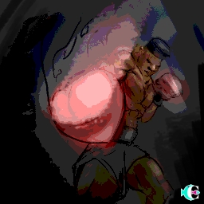

> ID #6. published 09/29/2020. republished 11/06/2020.

 <iframe width="370" height="208" src="https://www.youtube.com/embed/YucxkRQ9tws" frameborder="0" allow="accelerometer; autoplay; clipboard-write; encrypted-media; gyroscope; picture-in-picture" allowfullscreen></iframe>

So once I wrote a sexist something without knowing it was sexist. I was misinterpreted twice.

Being misinterpreted for the first time is a serious matter, when it happens a second time it's dangerously serious. First time was by people who didn’t understand what I meant. It's so sad realizing you end up subtracting when all you wanna do is add. Second time I misinterpreted myself. It's exasperating to think that there might be something in here that I can't see and that I need to root out. It's a good thing that people are all so kind to me and help me see things in myself that I myself can't see.

A true boxer must know when to have his guard raised and when to lower it.

POW! Thanks.

**download audio:** <a href="/audio/BC-06-ali-audio-remix-en.mp4" target="_blank">#6 Muhammad Ali</a>

<iframe src="https://open.spotify.com/embed/track/3LyeB5mKdybZ7zjgjH9fcz" width="300" height="380" frameborder="0" allowtransparency="true" allow="encrypted-media"></iframe>