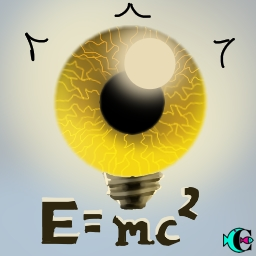

> ID #10. published 12/04/2020.

 <iframe width="370" height="208" src="https://www.youtube.com/embed/de815_d10x8" frameborder="0" allow="accelerometer; autoplay; clipboard-write; encrypted-media; gyroscope; picture-in-picture" allowfullscreen></iframe>

You know, I think about that too. Having a perception of the 5 senses is trivial. They’re what we were given so we could navigate the material world. They're our “concrete” tools to have a dialogue with the world. But some people say we have other senses, but these require much more subtlety to perceive. Like that chakra shit. I got this from the internet, what else is there to be said?: "According to Jordan Duchnycz, chakras are the electric motor of the soul."

This one time, going up THE MOUNT (Roraima), I open a door. It was Huxley talking about the brain's need to create a filter for the full blast of human experience, so that our species could focus on prosperity. First we survive and then we reproduce. But there's so much more he methodically studied and recorded in his experiences with LSD in his book “The Doors of Perception”. I highly recommend it	;)

The other thing that makes me reflect on this is that science is something that brings us down to the physical realm. But those who managed to model nature into mathematics, like Einstein, said: "The more I get deeper in Science, the closer I get to God".

So... What do I know!? Who knows... In a certain way, I wonder if our beliefs influence what happens in our lives...

<iframe src="https://open.spotify.com/embed/track/7DNUgm6huY0X8yTaDe44M7" width="300" height="380" frameborder="0" allowtransparency="true" allow="encrypted-media"></iframe>