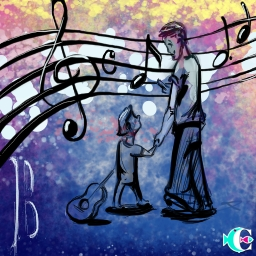

> ID #16. published 12/25/2020.

 <iframe width="370" height="208" src="https://www.youtube.com/embed/uDY9Ocki750" frameborder="0" allow="accelerometer; autoplay; clipboard-write; encrypted-media; gyroscope; picture-in-picture" allowfullscreen></iframe>

I wish I knew more about them. But life is long. I'll say that I didn't study them a lot, nor have I listened to them enough, as I was only born after they were no more. But somehow I can feel the feeling, the transformation they brought upon the world.

Do you remember "Você Decide"? For the young'uns, here's a piece of really old shit: "Você Decide" was kinda like an episode of a series that Globo aired every week and Tony Ramos was the presenter. The plot would then develop and by then end you could dial two telephone numbers so as to vote for two different endings. The ending with the most votes would win and that's the ending they showed.

Well, now here's the "Você Decide" of these words:

Ending 1:
A lot of it is because of the little that I've seen, but also because of what they represent to my dad and that **good things are passed on from generation to generation.**

Ending 2:
A lot of it is because of the little that I've seen, but also because of what they represent to my dad and that **all good things must come to an end.**

**download audio:** <a href="/audio/BC-16-beatles-audio-remix-en.mp3" target="_blank">#16 The Beatles. Você decide.</a>

<iframe src="https://open.spotify.com/embed/track/5jgFfDIR6FR0gvlA56Nakr" width="300" height="380" frameborder="0" allowtransparency="true" allow="encrypted-media"></iframe>