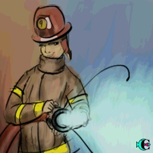

> ID #4. publicado em 27/09/2020. republicado em 30/10/2020.

 <iframe width="370" height="208" src="https://www.youtube.com/embed/9r51vzuj_yo" frameborder="0" allow="accelerometer; autoplay; clipboard-write; encrypted-media; gyroscope; picture-in-picture" allowfullscreen></iframe>

Esse negócio de internet é o negócio mais louco mesmo que eu já conheci. Parar pra pensar que eu agora consigo instantaneamente acessar praticamente todo conhecimento registrado pela humanidade é uma coisa muito louca mesmo. Louca louca. Crazeeey! (Tá bom, já deu pra entender)

Mas agora vai ficar mais louco ainda. Além disso que falei, que já é loucura, eu consigo acessar também milhares de situações corriqueiras que acontecem na vida dos outros. Pra esse aqui não dá nem pra encontrar um adjetivo.

Com isso vi um vídeo de uma mulher que tava gerando confusão alheia em ambiente familiar, incomodando a todos e completamente inconsequente. Bombeiro que é bombeiro nunca abandona a missão. Que foi essa outra que jogou água pra apagar o fogo da primeira e ainda teve a grandeza de dizer que tinham vários outros incomodados, mas ela teve que apagar o fogo sozinha..

E aí, eu me lembro do Pastor King.. O QUE ME PREOCUPA NÃO É O GRITO DOS MAUS, MAS O SILÊNCIO DOS BONS

Bombeires. Contrata-se. Paga-se muito bem.

DM @amearquitetura

**download audio:** <a href="/audio/BC-04-loucura-audio-remix-pt.mp4" target="_blank">#4 LOUCURA. Muita queimada para pouco bombeiro. Contrata-se.</a>

<iframe src="https://open.spotify.com/embed/track/6FlAJtf8aSZOpEj9ITSfYh" width="300" height="380" frameborder="0" allowtransparency="true" allow="encrypted-media"></iframe>