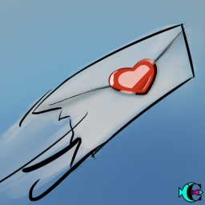

> ID #7. publicado em 30/09/2020. republicado em 09/11/2020.

 <iframe width="370" height="208" src="https://www.youtube.com/embed/18KPTM1-llY" frameborder="0" allow="accelerometer; autoplay; clipboard-write; encrypted-media; gyroscope; picture-in-picture" allowfullscreen></iframe>

É isso que está acontecendo com o mundo e a internet. As pessoas estão vendo muito mais intimidade alheia do que se é capaz de assimilar. São todos os tipos de situações que existem. Do nascimento, ao sexo à morte. De todo tipo de gente, de famosos a anônimos. Todos esses acontecimentos possuem um contexto. Várias partes envolvidas participaram com alguma bagagem nessa situação.
Mas como o volume de situações é enorme, a gente precisa preencher essa lacuna e o que sobra são nossas suposições.

E aí o distanciamento começa a ocorrer. Amigos de 30 anos estão se separando por isso, políticos repugnantes estão sendo eleitos e tomando as rédeas do mundo. Não é possível que eu seja o único achando isso tudo muito maluco. Pela lei da entropia, a tendência é que esse movimento continue se expandindo no mesmo sentido. Tomara que não, porque por mais que sejamos átomos, somos muito mais também. Se viver não for correr pelo correto não sei o que é. Então bora só reorganizar o coreto e viver mais perto das poucas situações que somos capazes de assimilar com empatia!?

**download audio:** <a href="/audio/BC-07-convite-audio-remix-pt.mp4" target="_blank">#7 O Mundo, a Internet, a Tese e O Convite</a>

<iframe src="https://open.spotify.com/embed/track/5Je169jvuK3BBZKy09m5Yn" width="300" height="380" frameborder="0" allowtransparency="true" allow="encrypted-media"></iframe>