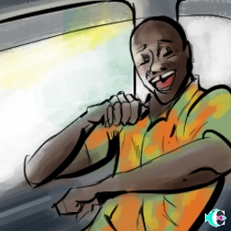

> ID #8. publicado em 01/10/2020. republicado em 13/11/2020.

 <iframe width="370" height="208" src="https://www.youtube.com/embed/Cvyu3FMC7_Y" frameborder="0" allow="accelerometer; autoplay; clipboard-write; encrypted-media; gyroscope; picture-in-picture" allowfullscreen></iframe>

Sextou! É dia da maldade. Dia de parar de fingir que você não é a pessoa que você é. Dia de mentalizar energia positiva pra tudo que está te esperando no fim de semana. Dia de fingir que a vida começou! Dia de começar a viver!

Diz-me-ia um sábio no cume de uma montanha onde a miragem era todo o mundo: “Comer e viajar, as 4 melhores coisas da vida”.

Mesmo sendo auto-explicativo, hoje é sexta-feira e tô a fim de zoar:

Sabe o sabor daquele camarão caprichadamente enrolado no fubá e temperado com especiarias? Pois é! Delícia, né?

Sabe aquele pastel de carne que sai da fritadeira pingando de óleo que precisa de muita atenção pra não se queimar? Pois é! Delícia, né?

Sabe aquela trip que você chega ao aeroporto, passa por toda cerimônia, senta na janela e acha que está no céu? Pois é! Delícia, né?

Sabe aquele rolé de bike que você tá fora do carro, dá pra ouvir os passarinhos, ver as moças bonitas, ver tudo com muito mais cor e dimensão? Pois é! Delícia, né?

Sabe aquele ônibus pra Chapada agendado pra sair às 4:20 sem horário pra voltar? Pois é! Delícia, né?

Sabe aquele linguado despelado, temperado, que derrete na boca...? Pois é! Delícia, né?

Sabe aquela flor que foi criada pra apertar, comer, destilar, desfiar, ...? Pois é! Delícia, né?

Agora é a tua vez de ESCOLHÊ qual vai SÊ do FINDÊ... Pois é! Delícia, né?

**download audio:** <a href="/audio/BC-08-comer-viajar-audio-remix-pt.mp4" target="_blank">#8 Comer e Viajar. Pois é.</a>

<iframe src="https://open.spotify.com/embed/track/7k9655GBLcnaQq1w2ak29r" width="300" height="380" frameborder="0" allowtransparency="true" allow="encrypted-media"></iframe>