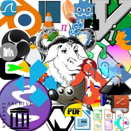

> ID #12. publicado em 11/12/2020.

 <iframe width="370" height="208" src="https://www.youtube.com/embed/LR5TlLVNlWg" frameborder="0" allow="accelerometer; autoplay; clipboard-write; encrypted-media; gyroscope; picture-in-picture" allowfullscreen></iframe>

A Rede social do futuro se chama GitHub. Não é do futuro a que vai ser o maior hype cool que todos estão usando. Do futuro, eu quero dizer: quem vai CONSTRUIR o futuro. Não é brincadeira. Essa parada foi inventada por: os caras do Git e Linus Torvalds (Ele de novo. O cara que fez o Linux, aquele sistema operacional que você nem imagina que é muito mais simples de usar que o famoso Windows.)

Mas não deixa de ser uma rede social. Busco ser bem didático, mas conheço pouco as outras redes sociais: você cria um perfil seu do mesmo jeito, foto, about, o que você gosta da vida. Mas você não publica fotos, nem textos, nem textos até 200 letras, nem que sua vida é boa mesmo que não seja. Lá você publica o seu trabalho. Mas não é qualquer trabalho. É código. Então lendo o código desse "match" você descobre a maturidade de programação que a pessoa/projeto tem, no que ela se envolve, se são mais projetos voluntários, se são projetos de alguma empresa capitalista, qual linguagem de programação que essa pessoa tem mais experiência, etc.. do tipo, acabei de escrever isso e imaginei que um código diz mais do que 1000 imagens.

Sobre resistência e revolução. Essa parada é rede social. Botou lá nunca mais é seu. Todo mundo usa. Tu não vai ganhar 1 centavo por isso. Tipo aquele vídeo de revenge porn que todo mundo se fode. Mas nesse caso ninguém se fode. O like do camaradinha chama "pull request" e é um reply pro teu código melhorando ele.

Se isso não é resistência e revolução, eu não sei o que é. Que camaradagem essa galera da TI tem. Isso porque esses felasdaputa tem um coração muito grande e não querem que os outros se fodam tanto quanto eles se fuderam. Aí eles escrevem um super manual de graça te dizendo como escapar de uma tarde miserável.

Habemus esperança.

**download audio:** <a href="/audio/BC-12-github-audio-remix-pt.mp3" target="_blank">#12 GitHub. Rede social. Resistência. Revolução. Palavras, imagens, códigos.</a>

<iframe src="https://open.spotify.com/embed/track/5uycfDlFeV8QcbPlO4Gg4C" width="300" height="380" frameborder="0" allowtransparency="true" allow="encrypted-media"></iframe>