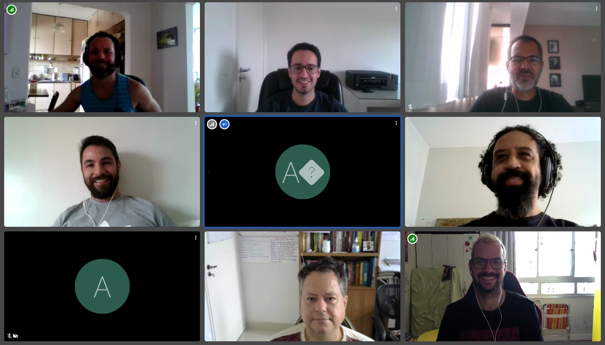

Vira-lata Caramelo. Ele é a cara do Brasil. Esteja você onde estiver,
não importa a sua classe social, seu endereço ou sua região, é certo que
no seu bairro, provavelmente na sua rua, há um simpático cãozinho da cor
caramelo vagando atrás de água, comida ou diversão. Que caricatura! 🐕

## Detalhamento

| id        | nome               | intervalo                   |
| --------- | ------------------ | --------------------------- |
| Sprint-12 | Vira-lata Caramelo | 07 a 18 de Setembro de 2020 |

## Time

Augusto, Luís, Marcelo, Nitai, Renê, Vitor, Washington.

## Histórias

1. ~~[Painel de atendimento] Incluir campo novo (avaliação de atendimento) - 1ª semana~~
1. ~~Implementar conjunto de melhorias de interface do Raio-x~~
> *Pendente validação e publicação em produção*
1. ~~Atualizar dados Raio-x para Agosto/20 (até onde der)~~
> *Faltou atualização dos dados de Custeio*
1. ~~Assimilar as DAGs da DELOG (dev da ENAP) - [3 de 10 DAGs]~~
> *Finalizando DAG sancoesMG_dag*
1. ~~(CONCLUIR) Reescrever carga do Orçamento via extração TG~~
1. ~~Realizar repasse de conhecimento sobre Airflow (DAG Covid19) para DELOG~~
> *Aguardando momento da DELOG para repasse de conhecimento*
1. ~~Disponibilizar Dados Abertos Automatizados Raio-x - Parte 2 de 2~~
> *Pendente validar descrições e publicar e extrair ocupação de cargos*
1. [API SIORG - Swagger] - Estudo técnico/negocial de melhorias
1. ~~[Cinedados] Assistir 1 filme coletivamente~~
> *Bladerunner 2049 em 18-09-2020 às 15:30*
1. (CONCLUIR) [DAGs] Incluir README documentando as dags em cada projeto
> *Ainda em execução*
1. ~~Evoluir deploy container Airflow [rever arquitetura, colocar na esturura do Rancher]~~
> *Falta concluir a migração e desligar o antigo*
1. ~~[DM SIORG] - Apresentação do Status atual e Refatorar/Ajustar modelo~~
1. ~~Apoiar DTI na implantação do portal de dados abertos do ME~~

**Histórias desejáveis**
* Resolver Backups das nossas aplicações
* Criar texto de missão/visão da nossa equipe
> Vamos criar o propósito, conforme essa orientação [aqui](https://targetteal.com/en/blog/throw-away-vision-mission-create-purpose/)

## Encerramento

😍🤖🛸

## Links

[Cronograma completo](https://docs.google.com/spreadsheets/d/1mvhFxE6dZfE3yS-29vS5D7n_SXEgsrNWzNnNRXVrmVY/edit#gid=304103167)

[Acompanhamento Gabinete](https://docs.google.com/spreadsheets/d/1awkLIhQmo0le-exMgK1xqtgGRBWftqMg2IQCtx6bfLU/edit#gid=1119539788&fvid=1174388734)

